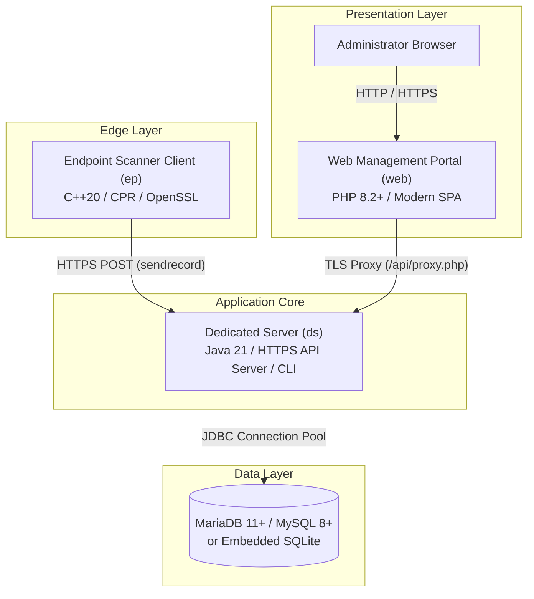

<div align=center>
  
  <h1>Flyaway</h1>
  <p>A Solution for Attendance Purposes</p>
</div>

</br>

FlyAway is an enterprise attendance verification and student early dismissal tracking system. Originally designed for automating vocational and work-based learning (CO-OP) student dismissals, it has evolved into a modular, multi-tier infrastructure supporting real-time badge scanning, cryptographic access authorization, hardware kiosk terminals, and centralized web management.

---

## Architecture Overview

FlyAway is composed of three interconnected sub-projects and a dual-engine database layer:



1. **`ds` (Dedicated Server)**:
   - Built on Java 21 OpenJDK.
   - Exposes an HTTPS JSON API on port 8000 using TLS 1.3.
   - Manages connection pooling, SQL aggregations, and business logic.
   - Includes an interactive administrative CLI shell on standard input.
   - See [Dedicated Server Documentation](ds/README.md).

2. **`ep` (Scanner Endpoint Client)**:
   - Written in modern C++20 utilizing libcpr (C++ Requests).
   - Runs on physical door kiosks, Raspberry Pis, or security desk terminals.
   - Reads barcode or RFID scanner wedge input and queries `ds` in real time.
   - Displays clear, color-coded visual clearance signals (`[APPROVED]` / `[REJECTED]`).
   - See [Endpoint Client Documentation](ep/README.md).

3. **`web` (Administrative Web Portal)**:
   - Built with PHP 8.2+ and vanilla JavaScript / modern CSS3 glassmorphism.
   - Single Page Application (SPA) dashboard for attendance oversight, student roster management, device token generation, and admin accounts.
   - Uses an authenticated internal reverse proxy (`/api/proxy.php`) to isolate backend services.
   - See [Web Portal Documentation](web/README.md).

4. **Database Layer**:
   - Primary: Remote MySQL 8+ or MariaDB 11+ (tested on Debian 13 LXC containers).
   - Fallback: Local embedded SQLite database (`flyaway.db`) with zero external configuration.

---

## System Requirements and Dependencies

### Linux Systems (Arch Linux, Ubuntu, Debian, Fedora)

| Component | Minimum Version | Package Dependencies |
| :--- | :--- | :--- |
| **ds** | Java 21 JDK | `jdk21-openjdk` / `openjdk-21-jdk` |
| **ep** | C++20, CMake 3.20+ | `base-devel`, `cmake`, `curl`, `openssl`, `git` |
| **web** | PHP 8.2+ | `php`, `php-curl` |
| **Database** | MariaDB 10.5+ / MySQL 8.0+ | `mariadb-server` (or remote database) |

#### Quick Install Command (Arch Linux):
```bash
sudo pacman -S jdk21-openjdk cmake curl openssl git php php-curl
```

#### Quick Install Command (Ubuntu / Debian):
```bash
sudo apt-get update && sudo apt-get install -y openjdk-21-jdk build-essential cmake libcurl4-openssl-dev libssl-dev git php php-curl php-json
```

---

### Windows Systems (Windows 10, Windows 11, Windows Server)

| Component | Tool / Runtime | Installation Method |
| :--- | :--- | :--- |
| **ds** | Eclipse Temurin OpenJDK 21 | `winget install EclipseAdoptium.Temurin.21.JDK` |
| **ep** | Visual Studio 2022 (C++20) + CMake | `winget install Microsoft.VisualStudio.2022.Community` |
| **web** | PHP 8.2+ for Windows | Download from [windows.php.net](https://windows.php.net/download/) |
| **Database** | MariaDB / MySQL or SQLite | Local install or remote server connection |

---

## Installation and Quick Start

### 1. Clone Repository and Configure Environment

```bash
git clone https://github.com/SushiBirb/FlyAway.git
cd FlyAway

# Copy sample environment configuration
cp .env.example .env
```

Edit `.env` to configure your database connection:

```ini
# Remote MariaDB/MySQL Configuration
DB_HOST=192.168.2.10
DB_PORT=3306
DB_DATABASE=flyaway
DB_USER=flyaway
DB_PASSWORD=flyawaypass

# Leave DB_HOST unset to automatically fall back to local SQLite:
# DB_HOST=
```

---

### 2. Launch Dedicated Server (`ds`)

```bash
cd ds
chmod +x run.sh
./run.sh
```

On first startup, the server automatically initializes database tables, creates performance indexes, and seeds the default administrator account.

**Default Administrator Account:**
- Username: `admin`
- Password: `admin`

---

### 3. Launch Web Management Portal (`web`)

In a new terminal window:

```bash
cd web
chmod +x run.sh
./run.sh
```

Navigate to `http://localhost:3000` in your web browser and sign in using your administrator credentials.

---

### 4. Build and Run Scanner Endpoint (`ep`)

In a new terminal window:

```bash
cd ep
cmake -B build -S . -DCMAKE_BUILD_TYPE=Release
cmake --build build -j$(nproc)

# Launch scanner client with hardware token
./build/ep --url https://localhost:8000/ --token e1111111-1111-1111-1111-111111111111 --cert cert.pem
```

Scan any student badge number or type an ID (e.g., `100204`) to receive immediate clearance results.

---

## High-Volume Scalability

FlyAway has been benchmarked and validated under high-capacity institutional workloads:

- **50,000+ Student Database**: Verified with 50,000 active student records (~30% early departure authorization distribution).
- **SQL Aggregations**: Dashboard metrics (total enrolled, authorized counts, scan totals) are computed directly by database engines in single-digit milliseconds rather than loading multi-megabyte payloads into application memory.
- **Server-Side Pagination & Debouncing**: The web interface utilizes server-side pagination (25 to 200 items per page) and 300ms search input debouncing, ensuring instantaneous response times without browser DOM lag.
- **Batch CSV Ingestion**: Roster synchronization processes bulk CSV uploads in batches of 500 rows using JDBC batch prepared statements.

---

## Security Architecture

- **Transport Layer Security**: All internal communication between edge kiosks, web proxies, and dedicated servers is encrypted over TLS 1.3.
- **PBKDF2 Password Hashing**: Administrator credentials use `PBKDF2WithHmacSHA256` with unique 16-byte cryptographic salts and 65,536 iterations. Two-stage hashing ensures raw passwords never travel across internal networks.
- **Scoped API Tokens**: Hardware scanners use unique 36-character UUID tokens that can be revoked instantaneously from the web dashboard.
- **Session Security**: Web sessions employ strict security controls including `HttpOnly`, `SameSite=Strict`, session fixation defense via ID regeneration, and per-session CSRF validation tokens.
- **Rate Limiting**: Sliding-window rate limiting protects the API from brute-force attempts and denial-of-service traffic.

---

## Detailed Documentation Links

- [Dedicated Server Documentation (`ds/README.md`)](ds/README.md)
  - Complete CLI commands, schema specifications, full HTTPS JSON API reference, and systemd service files.
- [Scanner Endpoint Documentation (`ep/README.md`)](ep/README.md)
  - Hardware scanner compatibility, CMake compilation guides, command-line arguments, and kiosk auto-start configuration.
- [Web Portal Documentation (`web/README.md`)](web/README.md)
  - SPA architecture, reverse proxy design, session security, and production web server guides (Caddy, Nginx, Apache).

---

## Authors

FlyAway was developed and maintained by **Aspectious** and **Sushibirb**.
